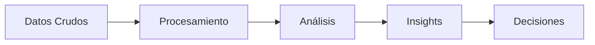
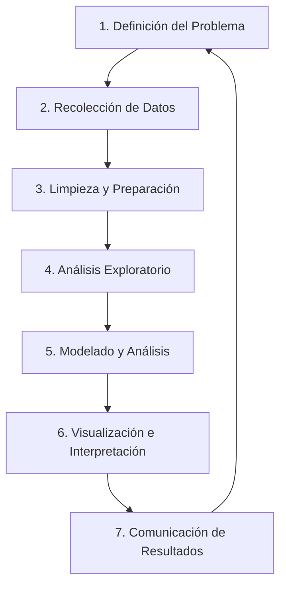

# Semana 1: Conceptos Fundamentales del Análisis de Datos
## Curso: Analítica de Datos | Código: PRECA EST23001

---

> 🎯 **Resultado de Aprendizaje de la Unidad:**  
> Identifica las etapas del proceso de análisis de datos, las fuentes y tipos de datos, y los métodos adecuados para su análisis.

> 📌 **Objetivos Específicos de la Semana 1:**
> 1. Comprender el concepto y la importancia del análisis de datos en la toma de decisiones.

El **análisis de datos** es el proceso de inspeccionar, limpiar, transformar y modelar datos con el objetivo de descubrir información útil, llegar a conclusiones y apoyar la toma de decisiones.

### 💡 Importancia en el Contexto Empresarial

| Beneficio | Descripción |
| :--- | :--- |
| **Toma de decisiones basada en evidencia** | Reduce la incertidumbre y el sesgo intuitivo, permitiendo fundamentar las estrategias en datos reales y verificables. |
| **Identificación de oportunidades** | Detecta tendencias, patrones de mercado y nichos no explorados que pueden generar ventajas competitivas. |
| **Optimización de procesos** | Mejora la eficiencia operativa al identificar cuellos de botella, desperdicios y áreas de mejora en los flujos de trabajo. |
| **Predicción de escenarios** | Anticipa comportamientos futuros del mercado, clientes o variables económicas mediante modelos predictivos. |
| **Reducción de riesgos** | Permite evaluar probabilidades de fracaso y diseñar planes de contingencia basados en evidencia histórica. |
| **Personalización de la experiencia** | Facilita la segmentación de clientes para ofrecer productos, servicios y comunicaciones más relevantes. |

2. Etapas del Proceso de Análisis de Datos

