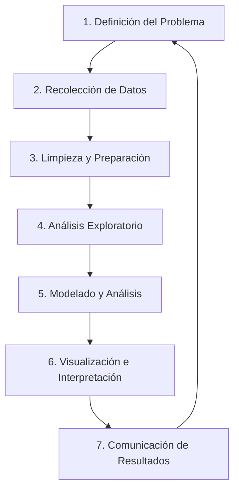

# Semana 1: Conceptos Fundamentales del Análisis de Datos
## Curso: Analítica de Datos | Código: PRECA EST23001

---

> 🎯 **Resultado de Aprendizaje de la Unidad:**  
> Identifica las etapas del proceso de análisis de datos, las fuentes y tipos de datos, y los métodos adecuados para su análisis.

> 📌 **Objetivos Específicos de la Semana 1:**
> 1. Comprender el concepto y la importancia del análisis de datos en la toma de decisiones.

El **análisis de datos** es el proceso de inspeccionar, limpiar, transformar y modelar datos con el objetivo de descubrir información útil, llegar a conclusiones y apoyar la toma de decisiones.

### 💡 Importancia en el Contexto Empresarial

| Beneficio | Descripción |
| :--- | :--- |
| **Toma de decisiones basada en evidencia** | Reduce la incertidumbre y el sesgo intuitivo, permitiendo fundamentar las estrategias en datos reales y verificables. |
| **Identificación de oportunidades** | Detecta tendencias, patrones de mercado y nichos no explorados que pueden generar ventajas competitivas. |
| **Optimización de procesos** | Mejora la eficiencia operativa al identificar cuellos de botella, desperdicios y áreas de mejora en los flujos de trabajo. |
| **Predicción de escenarios** | Anticipa comportamientos futuros del mercado, clientes o variables económicas mediante modelos predictivos. |
| **Reducción de riesgos** | Permite evaluar probabilidades de fracaso y diseñar planes de contingencia basados en evidencia histórica. |
| **Personalización de la experiencia** | Facilita la segmentación de clientes para ofrecer productos, servicios y comunicaciones más relevantes. |

2. Etapas del Proceso de Análisis de Datos

📋 Detalle de Cada Etapa
Etapa 1: Definición del Problema

✅ Preguntas clave:
- ¿Qué decisión necesitamos tomar?
- ¿Qué pregunta queremos responder con los datos?
- ¿Cuáles son los criterios de éxito?

📋 Entregable: Documento de objetivos y alcance del análisis

Etapa 2: Recolección de Datos

🔹 Fuentes de datos:
| Tipo | Ejemplos |
|------|----------|
| Internas | CRM, ERP, bases de datos corporativas |
| Externas | APIs públicas, encuestas, redes sociales |
| Primarias | Datos recolectados directamente |
| Secundarias | Datos ya procesados por terceros |

⚠️ Consideraciones: Calidad, relevancia, ética y privacidad

Etapa 3: Limpieza y Preparación

# Ejemplo conceptual de limpieza de datos en Python
import pandas as pd

# Cargar datos
df = pd.read_csv('datos.csv')

# Identificar valores nulos
print(df.isnull().sum())

# Eliminar duplicados
df = df.drop_duplicates()

# Tratar valores atípicos (outliers)
# ... código de tratamiento

Etapa 4: Análisis Exploratorio de Datos (EDA)

🔍 Objetivos del EDA:
• Comprender la estructura y distribución de los datos
• Identificar relaciones entre variables
• Detectar patrones, anomalías o tendencias

📊 Técnicas comunes:
- Estadísticos descriptivos (media, mediana, desviación)
- Visualizaciones: histogramas, boxplots, scatter plots
- Matrices de correlación

Etapa 5: Modelado y Análisis

🧠 Enfoques según el objetivo:

| Tipo de Análisis | Pregunta que responde | Técnicas |
|-----------------|----------------------|----------|
| Descriptivo | ¿Qué pasó? | Resúmenes, dashboards |
| Diagnóstico | ¿Por qué pasó? | Correlación, segmentación |
| Predictivo | ¿Qué podría pasar? | Regresión, clasificación |
| Prescriptivo | ¿Qué deberíamos hacer? | Optimización, simulación |

Etapa 6: Visualización e Interpretación

🎨 Principios de visualización efectiva:
1. Claridad: El mensaje debe ser entendido en segundos
2. Relevancia: Mostrar solo lo importante
3. Honestidad: No distorsionar la información
4. Estética: Diseño limpio y profesional

📈 Herramientas sugeridas:
- Power BI, Tableau, Looker Studio
- Python: matplotlib, seaborn, plotly
- R: ggplot2, shiny

Etapa 7: Comunicación de Resultados

🗣️ Elementos de un reporte efectivo:

✅ Estructura recomendada:
1. Resumen ejecutivo (1 página)
2. Contexto y objetivos
3. Metodología utilizada
4. Hallazgos principales con visualizaciones
5. Conclusiones y recomendaciones accionables
6. Limitaciones y próximos pasos

💡 Tip: Adapta el lenguaje técnico según tu audiencia